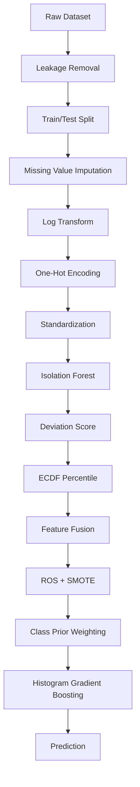

# AegisFlow AI Engine

## Adaptive API Access Behaviour Anomaly Detection

AegisFlow AI Engine is a production-oriented machine learning pipeline for API access behaviour anomaly detection.

It reproduces and extends the **Normality Fusion Hybrid Model** proposed for API access behaviour anomaly detection by combining unsupervised anomaly modelling with supervised classification.

Unlike traditional classifiers, the model first learns **normal API behaviour** using an Isolation Forest, converts anomaly scores into calibrated normality features, and fuses those features with behavioural attributes before training a Histogram-based Gradient Boosting classifier.

The AI Engine is designed as the future intelligence layer of the AegisFlow adaptive API protection platform.

---

# Features

## Complete Paper Reproduction

- Complete preprocessing pipeline
- Leakage removal
- 70:30 Train/Test split
- Missing value imputation
- Log transformation
- One-Hot Encoding
- Feature standardization

---

## Normality Modelling

Isolation Forest trained exclusively on **Normal** traffic.

Implemented:

- Isolation Forest
- Continuous deviation score
- ECDF percentile normalization
- Normality feature fusion

---

## Class Imbalance Handling

Implements the same methodology described in the paper.

Training only:

- Random Over Sampling (ROS)
- SMOTE
- Class-prior weighting

The held-out test set is never modified.

---

## Models

Three models are implemented.

### Logistic Regression

Linear baseline classifier.

---

### Histogram Gradient Boosting

Uses only original behavioural features.

Acts as the paper baseline.

---

### Normality Fusion Hybrid Model

Original behavioural features

+

Isolation Forest deviation score

+

ECDF percentile rank

↓

Histogram Gradient Boosting

---

# Pipeline



---

# Repository Structure

```
ai-engine/

├── artifacts/
│
│   ├── models/
│   │
│   ├── plots/
│   │
│   └── results/
│
├── docs/
│
├── src/
│
│   ├── preprocessing/
│   ├── features/
│   ├── models/
│   ├── training/
│   ├── evaluation/
│   └── utils/
│
├── train.py
│
├── requirements.txt
│
└── README.md
```

---

# Methodology

## Stage 1

Dataset preprocessing

- Leakage removal
- Missing value imputation
- Log transformation
- One-Hot Encoding
- Standardization

---

## Stage 2

Isolation Forest learns the manifold of **normal API behaviour**.

Hyperparameters

| Parameter | Value |
|-----------|------:|
| Trees | 800 |
| Contamination | 0.01 |
| Random State | 42 |

---

## Stage 3

Deviation score

```
Deviation = -score_samples(x)
```

Higher values indicate more abnormal behaviour.

---

## Stage 4

ECDF

Deviation scores are converted into percentile-normalized features using an empirical cumulative distribution function.

---

## Stage 5

Normality Feature Fusion

Two new features are appended.

- normality_deviation
- normality_percentile

---

## Stage 6

Training-only resampling

Attack

↓

Random Over Sampling

Bot + Normal

↓

SMOTE

---

## Stage 7

Histogram Gradient Boosting

Hyperparameters

| Parameter | Value |
|-----------|------:|
| Max Depth | 7 |
| Learning Rate | 0.05 |
| Iterations | 700 |
| Min Samples Leaf | 30 |
| Random State | 42 |

---

# Evaluation

Implemented metrics

- Accuracy
- Precision
- Recall
- Macro F1
- Weighted F1
- ROC-AUC
- Confusion Matrix
- Classification Report

---

# Baseline Models

The paper compares against two baselines.

Implemented:

- Logistic Regression
- Histogram Gradient Boosting

Both are evaluated on the identical held-out test set.

---

# Ablation Study

Three experiments are included.

| Experiment | Description |
|------------|-------------|
| Original Features | Plain HGB |
| Original + Deviation | HGB with deviation score |
| Original + Deviation + Percentile | Full Normality Fusion |

This quantifies the contribution of each additional feature.

---

# Generated Artifacts

## Models

```
artifacts/models/

isolation_forest.joblib

hist_gradient_boosting.joblib

logistic_regression.joblib
```

---

## Figures

```
artifacts/plots/

fusion_confusion.png

hgb_confusion.png

logistic_confusion.png

roc_fusion.png

roc_hgb.png

roc_logistic.png

feature_importance.png

accuracy.png

macro_f1.png

weighted_f1.png

roc_auc.png
```

---

## Results

```
artifacts/results/

model_comparison.csv

ablation.csv

error_analysis.csv

fusion_metrics.json

hgb_metrics.json

logistic_metrics.json

training_times.json

model_metadata.json
```

---

# Example Results

Current implementation reproduces the paper's methodology while achieving strong performance.

| Model | Accuracy | Macro F1 |
|------|------:|------:|
| Logistic Regression | 0.9308 | 0.6452 |
| HGB Baseline | 0.9910 | 0.8394 |
| Normality Fusion | **0.9915** | **0.8476** |

---

# Feature Importance

Permutation importance is computed for the complete Normality Fusion model.

This allows direct measurement of the contribution of

- normality_deviation
- normality_percentile

relative to the original behavioural features.

---

# Error Analysis

Automatically generated.

Includes

- True class
- Predicted class
- Misclassification count

This reproduces the qualitative error analysis presented in the paper.

---

# Reproducibility

Python

```
3.11
```

scikit-learn

```
1.9
```

imbalanced-learn

```
0.14
```

Random State

```
42
```

---

# Running

Install dependencies

```bash
pip install -r requirements.txt
```

Train all models

```bash
python train.py
```

Generated artifacts will be written into

```
artifacts/
```

---

# Future Work

The current repository reproduces the research paper.

The next phase integrates the AI Engine into the AegisFlow production gateway.

Planned features include

- Real-time streaming inference
- Online feature extraction
- Sliding-window behavioural statistics
- Session velocity analysis
- Endpoint entropy
- Request burst detection
- Risk scoring
- Adaptive policy engine
- Continuous retraining
- Concept drift detection
- Model registry
- Feature store
- Kubernetes deployment
- Prometheus monitoring
- OpenTelemetry integration

---

# Relationship to AegisFlow

This repository represents the intelligence layer of the AegisFlow platform.

```
Client
        │
        ▼
API Gateway
        │
        ▼
Runtime Manager
        │
        ├────────► Metrics
        │
        ├────────► OpenTelemetry
        │
        ├────────► Prometheus
        │
        ▼
AI Engine
        │
        ▼
Risk Score
        │
        ▼
Policy Engine

ALLOW

RATE LIMIT

CHALLENGE

BLOCK
```

---

# License

This project is part of the AegisFlow adaptive API protection platform.

---

# Acknowledgements

This implementation reproduces the methodology presented in the Normality Fusion Hybrid Model paper and extends it with

- automated evaluation
- reproducible experiments
- baseline implementations
- ablation studies
- feature importance analysis
- visualization
- production-oriented project structure

to serve as the machine learning foundation for the AegisFlow adaptive API security platform.