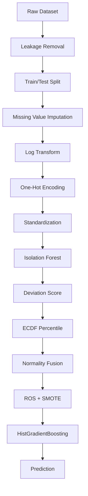

```mermaid
flowchart TD

A[Raw Dataset]

--> B[Leakage Removal]

--> C[Train/Test Split]

--> D[Missing Value Imputation]

--> E[Log Transform]

--> F[One-Hot Encoding]

--> G[Standardization]

G --> H[Isolation Forest]

H --> I[Deviation Score]

I --> J[ECDF Percentile]

J --> K[Normality Fusion]

K --> L[ROS + SMOTE]

L --> M[HistGradientBoosting]

M --> N[Prediction]
```